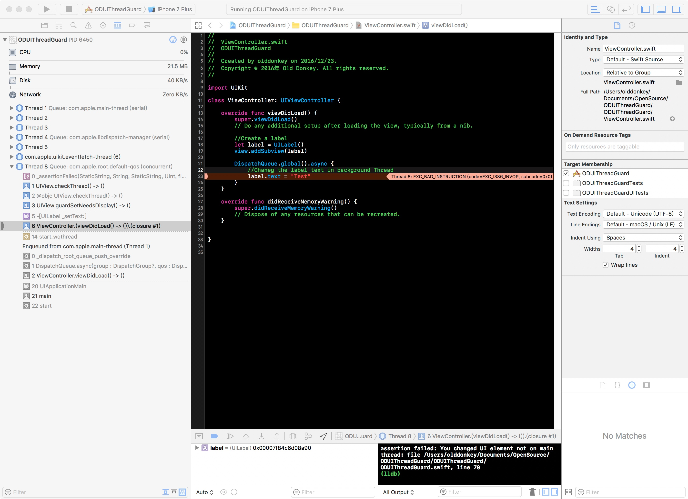

# ODUIThreadGuard
>ODUIThreadGuard is a guard to help check if you make UI changes not in main thread.

>As Xcode 9 embedded this function into Xcode, there is no reason to maintain this project in the feature, Happy Coding.

[](https://github.com/Carthage/Carthage) 
 
 
 

ODUIThreadGuard is a guard to help check if you make UI changes not in main thread.
Highly recommend you add this file to your project as early as possible.



## Features

- [x] Passive implementation
- [x] Throw an assertion if setNeedsDisplay, setNeedsLayout, or setNeedsDisplayInRect: is called for instantiation of any UIView
- [x] Get the thread stack to help you locate where you make the mistake


## Usage

No matter which way you use ODUIThreadGuard, no need to import any files, it is a extension of UIView, so it will work automatically.

#### CocoaPods
You can use [CocoaPods](http://cocoapods.org/) to install `ODUIThreadGuard` by adding it to your `Podfile`:

```ruby
platform :ios, '8.0'
use_frameworks!
pod 'ODUIThreadGuard'
```

Then drop ODUIThreadGuard.swift into your porject.

#### Carthage
Create a `Cartfile` that lists the framework and run `carthage update`. Follow the [instructions](https://github.com/Carthage/Carthage#if-youre-building-for-ios) to add `$(SRCROOT)/Carthage/Build/iOS/YourLibrary.framework` to an iOS project.

```
github "olddonkey/ODUIThreadGuard"
```
#### Manually
1. Download and drop ```ODUIThreadGuard.swift``` in your project.  
2. Congratulations!  

You can change the pre compile flag to change the setting, in default, this only runs in DEBUG mode, so won't affect users in Release.

## Requirements

- iOS 8.0+
- Swift 3

The main development of ODUIThreadGuard is based on Swift 3.

### Contact

Follow and contact me through email: olddonkeyblog@gmail.com. If you find an issue, just [open a ticket](https://github.com/olddonkey/ODUIThreadGuard/issues/new) on it. Pull requests are warmly welcome as well.

### License

ODUIThreadGuard is released under the MIT license. See LICENSE for details.
